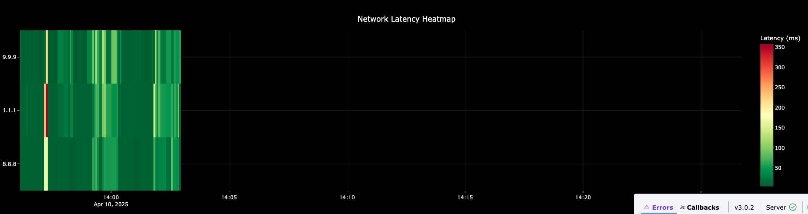

# Ping Canvas

A simple dashboard to monitor network performance.

## Features

- Real-time network latency monitoring
- Speed testing (download and upload)
- Traceroute visualization
- Multi-host latency heatmap
- Dark mode interface

## Installation

```bash
pip install -r requirements.txt
```

## Usage

```bash
python src/main.py
```

Then open http://localhost:8050 in your browser.

## Screenshots

### Dashboard Overview


### Network Metrics


### Latency Heatmap



